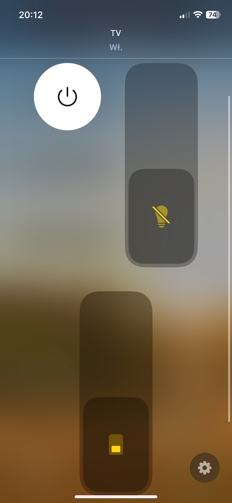
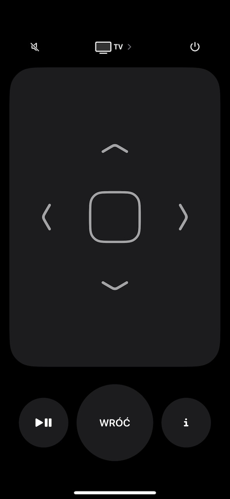

# Philips TV ver 6 with Ambilight - Homebridge Plugin

This plugin allows you to expose your **Philips TV with API ver. 6** to HomeKit.

Essentially this makes your Philips TV manufactured since 2016 show in Apple Home. 
And it also allows you to control it via Siri.

## Features:
* turn the TV on/off,
* use your iPhone as a remote,
* turn the screen on/off (useful with OLEDs!),
* control Ambilight (with color selection),
* this plugin also automatically updates the status of the TV, thus you can make automations.




After configuring the plugin, you need to pair the TV via *Add accessory* > *More*. 

#### Note about controlling TV volume

This plugin allows you to control the TV and its volume. To use your phone as remote, you need to use the iPhone *remote* wigdet (as shown in the second screenshot above).

The *remote* on your iPhone also **allows you to mute the TV** or **control its volume**. To control the volume, open the remote on your iPhone, **and then use the physical volume buttons** of your iPhone.

## Configuration

Just use the Homebrige UI to configure it. But if you prefer JSON config, use this cheat sheet:

```json
    "platforms": [ 
        {
            "tvs": [
                {
                    "name": "Philips TV",
                    "api_url": "https://192.168.1.28:1926/6/",
                    "wol_mac": "F0:A1:B2:C3:D4:E5",
                    "wol_options": {},
                    "wake_up_delay": 3000,
                    "api_auth": {
                        "username": "ABtvF0czCoW1337",
                        "password": "de5fab111b76aa8180cc51215c9112637aaa1031a18b3130ac81ee2d042218c3"
                    },
                    "api_timeout": 3000,
                    "auto_update_interval": 30000,
                    "custom_color_ambilight": true,
                    "metadata": {
                        "model": "55OLED705/12",
                        "manufacturer": "Philips",
                        "serialNumber": "custom_serial_number(optional)"
                    },
                    "key_mapping": [
                        { 
                            "remote_key": "PLAY_PAUSE",
                            "philips_key": "Source"
                        }
                    ],
                    "ambilight_options": {}
                }
            ],
            "platform": "PhilipsTV2020Platform"
        }
    ]
```

| Property | Description |
|-|-|
| `name` | Your TV needs a name, choose whatever you want | 
| `api_url` | Full API URL, with protocol (https), IP address, port and API version (/6/) |
| `wol_mac` | MAC Address of your TV WiFi; you need this if you want to turn it on. |
| `wake_up_delay` | Your TV needs to 'warm up' after waking up to actually handle the request that turns it on, it's the time needed for this warm-up |
| `api_auth` | Credentials for the API (see next section) |
| `api_timeout` | Maximum time the plugin will wait for your TV to respond (keep it below 5s) |
| `auto_update_interval` | Interval of background status checks (this is a check whether your TV is on, it will update the status in Homekit) |
| `custom_color_ambilight` | If true then the color of Ambilight will be configurable |
| `metadata` | Technical data about your TV (optional) |
| `key_mapping` | Non-standard mapping for remote keys (optional). `remote_key` is a key from a class RemoteKey. `philips_key` is a key as used in the Philips TV API |
| `wol_options` | Advanced WOL options (optional) - see below |
| `ambilight_options` | Advanced Ambilight options (optional) - see below |

**Note:** the delay/time unit is *milliseconds*. 30000 means **30 seconds**.

## Credentials for 2016 (and newer?) models with Android TV

As per [this project](https://github.com/suborb/philips_android_tv) the Android TV 2016 models Philips use an authenticated HTTPS [JointSpace](http://jointspace.sourceforge.net/) API version 6.
Every control- or status-call needs [digest authentification](https://en.wikipedia.org/wiki/Digest_access_authentication) which contains of a pre generated username and password. You have to do this once for your TV. We recommend to use the python script [philips\_android\_tv](https://github.com/suborb/philips_android_tv).

Here is an example pairing call for philips\_android\_tv :
```
python ./philips.py --host 192.168.0.12 pair
```

As a fresh alternative for python3 you can use [pylips](https://github.com/eslavnov/pylips#setting-up-pylips):

```
python3 pylips.py
```
Username and password will be located in `settings.ini`

You can then add username and password key in your homebridge config, example:
```json
    "platforms": [ 
        {
            "tvs": [
              {
                "accessory": "PhilipsTV",
                ...
                "api_auth": {
                  "username": "5l6n66UK7PYBVKAU",
                  "password": "de8d0d1911a6d3662540114e1b3a5f29a473cc413bf6b38afb97820facdcb1fb"
                }
              }
            ]
        }
    ]
]
 ```


## RemoteKey and Philips Key

This section describes keys used for custom remote key mapping (`key_mapping`). 
This mapping is used to override default key bindings used for iOS TV remote widget.

Currently Homebridge supports only the following RemoteKeys (you can use those in `remote_key` field):

```
    static readonly REWIND = 0;
    static readonly FAST_FORWARD = 1;
    static readonly NEXT_TRACK = 2;
    static readonly PREVIOUS_TRACK = 3;
    static readonly ARROW_UP = 4;
    static readonly ARROW_DOWN = 5;
    static readonly ARROW_LEFT = 6;
    static readonly ARROW_RIGHT = 7;
    static readonly SELECT = 8;
    static readonly BACK = 9;
    static readonly EXIT = 10;
    static readonly PLAY_PAUSE = 11;
    static readonly INFORMATION = 15;
```

Meanwhile, Philips TV supports the following keys (use these in `philips_key`):

* Standby
* Back
* Find
* RedColour
* GreenColour
* YellowColour
* BlueColour
* Home
* VolumeUp
* VolumeDown
* Mute
* Options
* Dot
* Digit0
* Digit1
* Digit2
* Digit3
* Digit4
* Digit5
* Digit6
* Digit7
* Digit8
* Digit9
* Info
* CursorUp
* CursorDown
* CursorLeft
* CursorRight
* Confirm
* Next
* Previous
* Adjust
* WatchTV
* Viewmode
* Teletext
* Subtitle
* ChannelStepUp
* ChannelStepDown
* Source
* AmbilightOnOff
* PlayPause
* Play
* Pause
* FastForward
* Stop
* Rewind
* Record
* Online


For example, if you wish to remap a `PLAY_PAUSE` button to `Source`, you can add this `key_mapping`:

```json
    "platforms": [ 
        {
            "tvs": [
                {
                    ...
                    "key_mapping": [
                        { 
                            "remote_key": "PLAY_PAUSE",
                            "philips_key": "Source"
                        }
                    ]
                }
            ],
            "platform": "PhilipsTV2020Platform"
        }
    ]
```

## Advanced Ambilight config

Ambilight by default works this way:

The plugin periodically checks what's the current Ambilight style. When you turn Ambilight OFF, then it will remember the last style you used.
When you turn Ambilight ON, then it will restore the style.

The plugin actually tracks two Ambilight styles - one when the TV screen is ON, one when the TV screen is OFF. It emulates the actual behavior of the Philips TVs, because the TV uses different styles for screen off and screen on.

The problem is - what **if you almost always disable Ambilight?** When will the plugin have the chance to check what style to use?

Actually, it will never check. And because of that, the Ambilight switch won't work correctly. You can fix that by setting the default styles.

```json
    "platforms": [ 
        {
            "tvs": [
                {
                    ...
                    "ambilight_options": {
                        "default_on_style": {"styleName":"FOLLOW_VIDEO","isExpert":false,"menuSetting":"GAME","stringValue":"Game"},
                        "always_use_default_on": false,
                        "default_off_style": {"styleName":"Lounge light","isExpert":false,"menuSetting":"ISF","stringValue":"Warm White"},
                        "always_use_default_off": false
                    }
                }
            ],
            "platform": "PhilipsTV2020Platform"
        }
    ]
```

| Property | Description |
|-|-|
| `default_on_style` | This is a default Ambilight style that will be applied when you turn Ambilight ON when the **screen is ON**. | 
| `always_use_default_on` | When the screen is **ON**: When true, then it will **always set default_on_style** when you turn Ambilight ON. When false, it will apply **last known style** (last one used by the TV). | 
| `default_off_style` | This is a default Ambilight style that will be applied when you turn Ambilight ON when the **screen is OFF**. |
| `coualways_use_default_off` | When the screen is **OFF**: When true, then it will **always set default_off_style** when you turn Ambilight ON. When false, it will apply **last known style** (last one used by the TV). |

`default_on_style` and `default_off_style` is used when the plugin does not know what style to apply when turning the Ambilight ON. 

The plugin automatically tracks Ambilight style changes and knows what is the current Ambilight style BUT sometimes it is not able to (for example: the Ambilight is OFF and it was never ON). These defaults are here as a failsafe.

**How to get the Ambilight style JSON?**

1. Setup the plugin.
2. Turn **Homebridge Debug -D** mode on.
3. Turn the TV on and set the Ambilight style you want using the TV remote.
4. Go to Homebridge logs and find `/ambilight/currentconfiguration` TV response -- here's the JSON!

Example:
```
[5/22/2025, 5:42:45 PM] [homebridge-philipstv-2020-ambilight] [Philips TV] [GET https://192.168.68.54:1926/6/ambilight/currentconfiguration] Response from TV {"styleName":"FOLLOW_VIDEO","isExpert":false,"menuSetting":"GAME","stringValue":"Game"}
```


## Advanced Wake On LAN (WOL) config

If you have problems with WOL (for example you see ` Unknown system error -126` in logs when you try to turn the TV on), then you can try and adjust advanced WOL settings.

**Do not set any of these settings if your WOL works correctly!**

```json
    "platforms": [ 
        {
            "tvs": [
                {
                    ...
                    "wol_options": {
                        "from": "10.10.10.101",
                        "port": 9,
                        "address": "255.255.255.255",
                        "count": 3,
                        "interval": 100
                    }
                }
            ],
            "platform": "PhilipsTV2020Platform"
        }
    ]
```

**All of these settings are optional, do not set the settings that you don't need!**


| Property | Description |
|-|-|
| `from` | IP address of the network interface that "talks" to the TV. This address should point to an interface that connects to the same subnet as the TV. | 
| `port` | Port used for WOL broadcast (default: 9)  | 
| `address` | Broadcast address. Default address 255.255.255.255 automatically broadcasts to the network interface set in `from` |
| `count` | The number of WOL retries (default: 3) |
| `interval` | The interval of WOL retries in ms (default: 100) |

To get the `from` address, you can use `ip a`. This command lists all your network interfaces with their IP addresses.

For example, I have a TV connected to Ethernet, having IP address `10.10.10.123`. 

The command `ip a` (run on the Homebridge host) returns the following output:

```text
1: eth0: <BROADCAST,MULTICAST,UP> mtu 1500 qdisc cbq qlen 100
    link/ether 00:a0:cc:66:18:78 brd ff:ff:ff:ff:ff:ff
    inet 193.233.7.90/24 brd 193.233.7.255 scope global eth0
    inet6 3ffe:2400:0:1:2a0:ccff:fe66:1878/64 scope global dynamic 
       valid_lft forever preferred_lft 604746sec
    inet6 fe80::2a0:ccff:fe66:1878/10 scope link 
2: eth1: <BROADCAST,MULTICAST,UP,LOWER_UP> mtu 1500 qdisc pfifo_fast state UP group default qlen 1000
    link/ether 08:00:27:e2:80:18 brd ff:ff:ff:ff:ff:ff
    inet 10.10.10.101/24 brd 10.0.2.255 scope global eth0 valid_lft forever preferred_lft forever
```

This means that the Homebridge host has two active network interfaces (*eth0* and *eth1*). 
Look at the *inet* values. *eth0* has IP `193.233.7.90`. *eth1* has IP `10.10.10.101`.

The TV has IP `10.10.10.123`. That means *eth1* connects to the TV, because it is the same subnet.

In this case you should use `10.10.10.101` as the correct value for the `from` field.